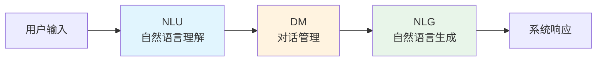
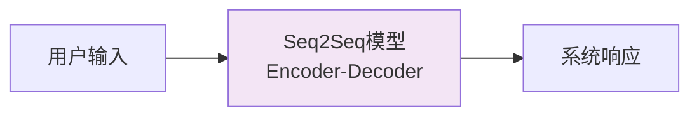
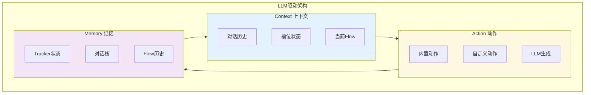

14. 多Agent
---

整体架构： 一个总的调度的Agent，类似网关，去识别分发到对应的子Agent中。 

OpenAIAgents中的挂载方式分两种:   

- Agent As Tools(管理员模式)： 把其他Agent作为协调Agent的工具，思想完全同单Agent下的Agent和工具的关系，整个控制权在协调Agent上。
- Handoffs(转接)：将用户的问题直接交给handoffs上的Agent。思想是直接将Agent挂载Agent下，整个控制权在具体干活的Agent上。

二者本质的区别是控制权的问题。 

### 架构设计理念

中心化调度: 所有的用户请求首先由一个“全知全能”的调度器接收，由它决定分发给哪个专家。

专才专用: 每个业务智能体只关注自己领域的 Prompt 和工具，避免 Prompt 污染，提升任务成功率。

流式响应: 全链路支持 Server-Sent Events (SSE)，让用户感知到智能体的思考过程 (Thinking Process)。

#### 调度智能体（Orchestrator）

角色: 门房、总指挥。

核心职责:

意图识别: 分析用户输入是 "电脑坏了" (技术问题) 还是 "哪有维修店" (服务问题)。要做什么

智能路由: 绝不直接回答技术细节（如“蓝屏怎么修”）将会话控制权 transfer 给对应的下游智能体。不做什么

流式响应: 实时将智能体的结果推送给用户。

边界守则：只决策，不执行

### 多轮对话系统架构

#### 第一种 传统Pipeline

传统对话系统采用流水线架构，将对话过程拆分为独立的模块:   

- NLU(Natural Language Understanding)，理解用户意图，提取实体。
- DM(Dialogue Management)，管理对话状态，决策下一步动作
- NLG(Natural Language Generation)：将动作转换为自然语言

NLU主要模块包含:    

- 意图识别(Intent Recognition): 判断用户想做什么
    - 输入: 我想查一下订单
    - 输出: intent=查询订单
- 实体提取(Entity Extraction): 提取关键信息
    - 输入: 订单号是12345
    - 输出: order_id=12345

意图识别（Intent Recognition）指的是让智能体理解用户通过自然语言表达的意图或目的。意图识别是智能助手的典型能力，例如用户在对话中输入“我想查看今天的 AI 新闻”，其中“查看新闻”为用户意图，也就是用户希望智能体执行的操作

DM模块详解:   
- 对话状态追踪(DST): 记录当前对话状态
- 对话策略(Policy): 决定下一步动作

**传统架构的优缺点**：

| 优点 | 缺点 |
|------|------|
| 模块化，易于调试 | 模块间误差累积 |
| 各模块可独立优化 | 需要大量标注数据 |
| 可解释性强 | 对新领域适应性差 |
| 适合垂直领域 | 开发成本高 |
    
    
#### 端到端架构(Seq2Seq)

**技术演进**：
1. **Seq2Seq + Attention**（2014-2017）
2. **Transformer**（2017-2019）
3. **预训练语言模型**（GPT、BERT，2018-2020）
4. **大语言模型**（ChatGPT、GPT-4，2022至今）

**端到端架构的优缺点**：

| 优点 | 缺点 |
|------|------|
| 无需人工设计特征 | 可解释性差 |
| 可以处理开放域对话 | 难以融入业务逻辑 |
| 生成更自然流畅 | 幻觉问题（生成错误信息） |
| 泛化能力强 | 难以精确控制对话流程 |

#### LLM驱动的对话架构】

**LLM驱动的对话架构**结合了传统架构的可控性和大模型的理解能力，

**核心三元设计**：

| 要素 | 英文 | 职责 | 实现 |
|------|------|------|------|
| **C** | Context | 提供完整上下文 | Tracker + 对话历史 + 槽位 |
| **A** | Action | 执行具体动作 | 可插拔动作体系 |
| **M** | Memory | 记忆对话状态 | 对话栈 + Flow历史 |

**核心设计思想**：
> 用LLM理解用户意图，用结构化命令控制对话流程，用可编程动作执行业务逻辑。

**架构优势**：

| 特性 | 说明 |
|------|------|
| **可控性** | Flow定义精确控制对话流程 |
| **灵活性** | 支持Flow嵌套、中断、恢复 |
| **可扩展性** | 动作系统可插拔，易于扩展 |
| **可调试性** | 状态可追踪，流程可观测 |
| **企业级** | 支持多轮对话、槽位收集、知识检索 |

> **让LLM负责理解，让框架负责控制，让开发者负责业务。**

